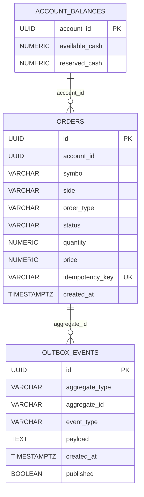

# ERD

이 문서는 현재 Flyway 스키마 기준의 ERD를 관리합니다.

현재 스키마는 `src/main/resources/db/migration/V1__init.sql`이 기준입니다.

## 관계 설명

- `account_balances.account_id`와 `orders.account_id`는 논리적으로 연결됩니다.
- 현재 DB 스키마에는 `orders.account_id`에 대한 foreign key 제약이 없습니다.
- `outbox_events.aggregate_id`는 주문 이벤트의 경우 `orders.id` 값을 문자열로 저장합니다.
- `outbox_events`는 여러 aggregate 이벤트를 담기 위한 범용 outbox 테이블이므로 특정 테이블에 foreign key를 걸지 않았습니다.

## 테이블 역할

### account_balances

계좌별 현금 잔고를 저장합니다.

- `available_cash`: 주문 가능 현금
- `reserved_cash`: 주문으로 예약된 현금

### orders

주문 원장을 저장합니다.

- `idempotency_key`는 중복 주문 요청을 막기 위한 unique key입니다.
- 현재 주문은 접수 과정에서 `PENDING`에서 `ACCEPTED` 상태로 전이됩니다.

### outbox_events

트랜잭셔널 outbox 이벤트를 저장합니다.

- 주문 접수와 같은 도메인 이벤트를 DB 트랜잭션 안에서 먼저 저장합니다.
- 이후 outbox publisher가 `published = false` 이벤트를 읽어 Kafka로 발행하는 구조를 목표로 합니다.

## 확장 후보

향후 체결과 보유 주식 흐름이 추가되면 아래 테이블이 후보입니다.

- `accounts`
- `positions`
- `executions`
- `trades`
- `order_events`
